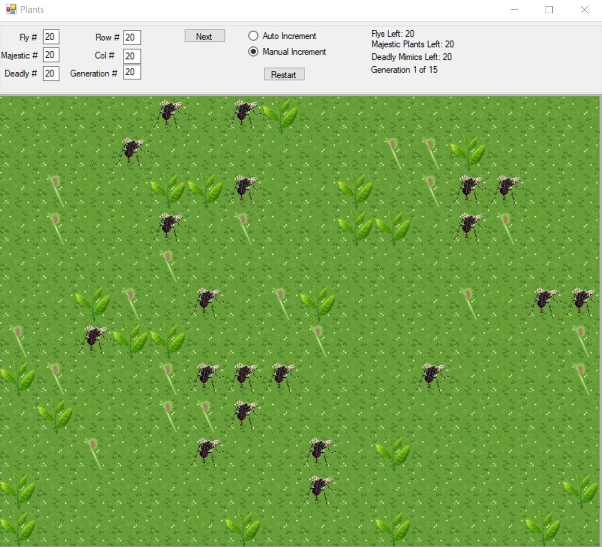
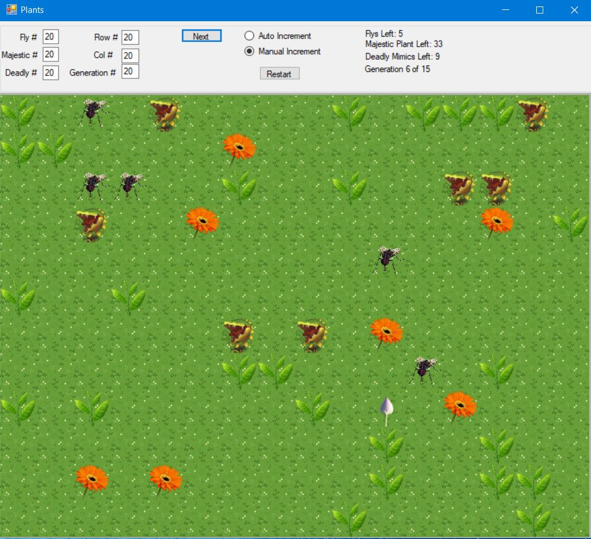
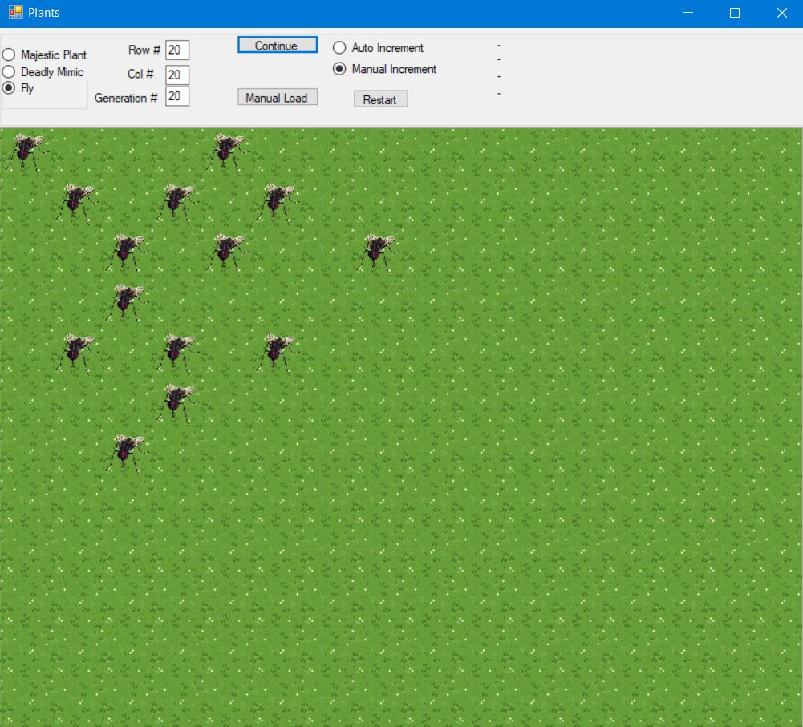

# GameOfLife_Plants

PURPOSE:  
To create a library (dll) of critters;  
to instantiate objects of classes in an inheritance hierarchy and polymorphically output each object’s attributes;  
to use static variables; to use a labels, text boxes and buttons;  
to use the switch statement; to use exception handling;  
to use a data structure to hold references to objects.  

PROBLEM: Plants, Majestic Plants, Deadly Mimics, Flies.  
Design an inheritance hierarchy for class the above actors. Use Actor as the base class of the hierarchy.  
Write a program that randomly generates data for a “Game of Life” automata.    

The program should  
-prompts the user for the number of each type of actor (the Majestic plant, the Deadly Mimic, and Flies)  
-randomly generate positions in the grid (making sure no 2 objects are in the same location)  
-displays a picture of the actor on the grid (DO NOT DRAW THIS. Find images online.)  
-prompt the user for the number of generations  
-run a simulation of the Game of Life, allowing the user to view each generation at the leisure or just showing the final result of apply the rules in the game of life as described below.  
-performs exception handling for negative (or illegal) values (and then allows user to try again)    

The rules in the game of life are as follows:  
Majestics are Plants, that when pollinated, sprout and grow for 2 more generations.  
Deadly mimics do all that and when they eat, they grow larger for 2 more generations.  
BUT if they don’t eat for 5 generations, they die. Flies eat Majestics and live another day.  
They can go 5 generations without eating. However, if a poor unsuspecting fly 
encounters a Deadly Mimic, they get eaten and cease to exist.

